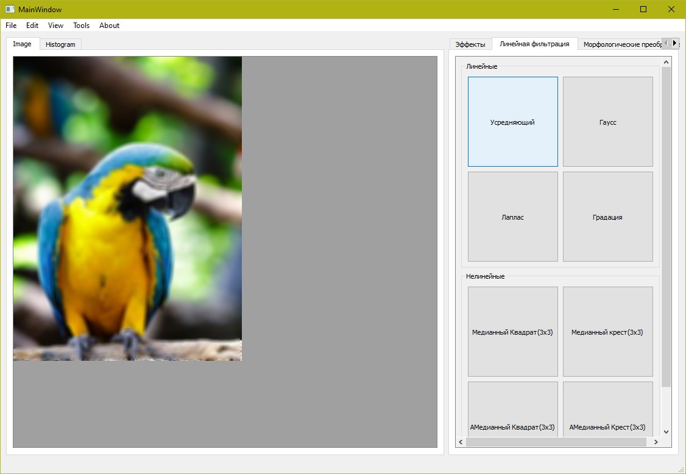

# Qt-Image_processing
 
 C++/Qt - Image processor. Supports effects:
 *Changes in contrast, brightness, gamma correction
 *Red filter
 *Green filter
 *Blue filter
 *Halftone filter
 *Negative
 *inversion in four directions
 *Equalization
 *Linear / Non-linear filtering (Median filter, Gaussian filter, Laplace filter, Gradient filter)
 *Morphological transformations (BW, Not, Or, And, Xor, Dilation, Erosion, Closing, Opening)
 *Supersampling

​
​
​
​
​
​
​
​